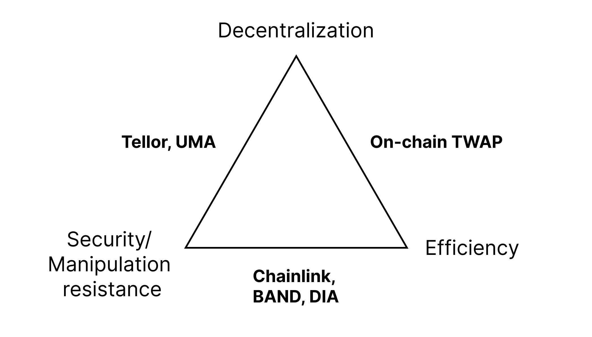

# Can centralization and decentralization live together amicably?

# Introduction

Centralization and decentralization are two opposing concepts that have been settled for debate for centuries, from real life to the software engineering of the modern world. Centralization is the concentration of power in a single authority, while decentralization is the distribution of power to multiple authorities, and participation for power is open to everyone. There have been numerous debates between centralization and decentralization, and many have begged the question: "Can centralization and decentralization live together amicably?". Through this article, we will provide a deep dive into the matter so that we can answer that question ourselves. Note that even though the content is technical, it is aimed to help non-tech people understand the tech better!

# But why?

Why would we need to combine centralization and decentralization - two totally opposing ideologies in software engineering together in the first place? One reason could be that there are numerous benefits from both worlds that we can extract, judging from a technical standpoint:

* Decentralization provides better freedom, censorship resistance, and transparency and avoids a single point of failure that could pose a vulnerability for applications.
* Centralization provides much better performance because there is less communication - no need for peer-to-peer communication between computers, and settlement/consensus is much easier to achieve when it is decided by one single party. Furthermore, content moderation and UX are much easier to deal with in centralized applications.

While there are numerous other factors to consider, this is our basic starting point for the idea.

# Centralization in a decentralized base layer

## The general idea

As mentioned earlier, decentralized applications provide better freedom, better censorship resistance, better transparency, and single-point-of-failure resilience. What if we could have that, but also with the benefits of centralized applications? A common misconception is that we need to make decentralized applications just for the sake of decentralization. Centralized applications are totally fine **if** it has all the benefits of a decentralized application.

Usually, we would fall into two of these designs for a good centralized-decentralized protocol:

* Use the centralized protocol primarily, but use the decentralized protocol as a fallback when things go wrong.
* Use the centralized protocol, but the centralized protocol can not do anything harmful because a decentralized protocol assures that.

In reality, these two designs might exist in protocols that we are using *right now*.

## Centralization in layer 2s/rollups

The most popular use of such a model can be seen in current layer 2 scaling solutions (rollups specifically) like Arbitrum, Fuel, zkSync, etc. This does not mean that layer 2s and rollups can not be fully decentralized, they totally can, but they can also be fine with a proper model that combines both centralization and decentralization.

Before going into this, we must have a look at how rollups work. They function primarily like a normal blockchain but use a "layer 1" blockchain network as a settlement/consensus layer to post their transaction batches/blocks on. The people who post rollup blocks are often called "sequencers". At the current state of rollups, decentralized sequencers are not yet implemented in most projects out there, the sequencer is usually just a node run by the developers/foundation. So how can they assure that everything works safely?

### What if the sequencer posts fraudulent blocks?

This is where two classes of rollups - "optimistic rollups" and "zk rollups" shine. These two kinds of rollups deal with the problem differently. Optimistic rollups assume that the blocks are always correct until someone says otherwise and submit a challenge to (only) revert faulty transactions and the sequencer is penalized (usually in money) if the challenge succeeds. If there is no challenge in a period of time (usually 7 days), the block is finalized and can not be challenged again. Its efficiency comes from the fact that fraud is rare and will be resolved in the end, so on-chain verification, which is expensive, is very rare. ZK rollups decide to do on-chain verification entirely, but through complex cryptography like SNARKs and STARKs to make the verification process possibly thousands more times cheaper. Overall, these two work because the layer one is still decentralized and keeps everything safe.

What we can get out of this is that sequencers **can not** post fradulent blocks even if it's centralized, which is a design that we have mentioned earlier.

### What if the sequencer is offline or blocks certain transactions?

In this case, we use a decentralized fallback as mentioned earlier. There are many ways to do this, some prefer to make users force-exit out of the rollup to transact on the layer 1, and some prefer to make users submit individual transactions to the rollup. But I believe a much better way to this is how Fuel or Arbitrum does it, they still use a centralized sequencer, but **anyone can upload entire rollup blocks if they need.**

Using a centralized sequencer also brings numerous benefits, like faster transaction propagation - we can send the transaction directly to the centralized sequencer rather than broadcasting it through the p2p network and waiting for a block builder to pick that up like a decentralized model would.

## Centralization in price oracles

### The oracle trilemma

Currently, oracles are divided into three main types: centralized oracles (Chainlink), optimistic oracles (UMA and Tellor), and on-chain oracles (TWAP oracles).

In short, these oracles can be described through this diagram:

Centralized oracles, in most cases, should be the cheapest, most efficient, and (surprisingly) safest option due to them being run by centralized companies. Their company depends entirely on the oracle service, so they must behave correctly. But this is not guaranteed because they are centralized. A price manipulation attack or offline nodes can happen if they want to because they have all the power to. Optimistic oracles work kind of similarly to what I have mentioned about optimistic rollups - data is correct until proven otherwise. Optimistic oracles are decentralized and secure but inefficient because of a long finality time. TWAP oracles work by getting a quote from a decentralized exchange (e.g. Uniswap) and running the price through a TWAP (time-weighted average price). This is by far the most decentralized option because you don't need any people online to make it work, and it is also efficient because data can be grabbed easily on-chain. However, they are prone to manipulation attacks if the liquidity for an asset is low, and they are the most manipulatable oracle out of the three.

### Oracle fallbacks

Many projects have concluded that a hybrid centralized and decentralized model is the solution. Centralized oracles will be used as the primary source of data. When certain conditions are broken, a decentralized oracle will be activated, replacing the centralized oracle temporarily. 

In practice, a protocol like Liquity uses both Chainlink and Tellor as their oracles. Liquity’s fallback will be used and the protocol starts using Tellor if:

* Chainlink price has not been updated for more than 4 hours.
* Chainlink response call reverts and returns an invalid price or an invalid timestamp.
* The price change between two consecutive Chainlink price updates is over 50%.

So the protocol can work both efficiently and securely.

## Centralization in light clients

### What are light clients?

To trustlessly use a blockchain network and dapps built on it, we need to be able to run a "node". Not to be confused with miners or validator nodes, a "node" is a mini server that is run on your device that reads the blockchain, stores account information, verifies blocks, processes transactions, etc. While hardware requirements for running a node in a decentralized blockchain network like Bitcoin, Ethereum, Chia, etc is affordable, it is only applicable for desktop computers or laptops, the requirements are just simply too big for mobile phones or low-end devices, this is why we have light clients - a light alternative that does not fully verify blocks but uses cryptographic tricks (e.g. Merkle trees) to ensure that the data received is still correct to an extent.

Light clients are the only secure and decentralized way for low-end devices to use the blockchain!

### Wait, what?

"But I'm using Metamask to transact both on my computers and my iPhone perfectly fine!" - you may ask. This is because Metamask and plenty of other wallets do not have a node built-in by default, and the node we are using is from centralized services like Infura. We must install extra tools and configure Metamask's settings to have our node running. This poses a threat as we are fully trusting these centralized services on the data they are giving to us. A solution for this is to integrate a light client between the user and the service, which renders the threat obsolete.

### But why do we need to do that?

If light clients work, then why do we need to centralize them towards node-providing services? This is due to finding nodes to feed our light clients data being a huge problem. The client needs to cleverly find nodes that are reliable, but even then, the source is still incredibly unreliable because of them being voluntarily run which brings extremely slow performance. If the network is small, there might be no node to feed light clients data at all! If the nodes are inconsistent and hard to find, why not just use existing nodes from existing centralized providers? Integrating a light client system into centralized services like Infura, Moralis or Quicknode can help bring high performance while maintaining complete security. If they go offline or censor our requests, we can go back to the decentralized mode. 

Overall, by combining light clients with centralized node providers, we can get better performance and reliability while maintaining the exact same security.

## Centralization in layer 1s

This might come as a surprise for many people, but centralization in layer 1's consensus will be inevitably centralized, but why and how do we deal with this?

In Proof-of-Stake chains, validators cooperatively work together to produce one block for every single round/slot. One will be chosen for creating the block, and others will be chosen for attesting the block by sending their approval signatures. The system is completely unscalable; if the amount of validators gets too big, there are too many messages to broadcast in the network, too many signatures to be stored in one block, etc. This is where we need to somehow centralize the validators, but how can we do it safely? A consensus protocol like DPoS (delegated proof of stake) lets users vote on a limited amount of validators (aka staking pools) to do the job which is not too ideal because it opens up vulnerabilities for cabalism and briberies, although it still works. Ethereum has an interesting approach to this, they randomly pick a small committee with the size of 1/32 of the validators, and through **binomial distribution**, an attacker still needs to have the same amount of validators to attack the network as he would if we were to pick all of the validators, statistically.

In Proof-of-Work chains, centralized mining pools are inevitable because of the mining reward system - there is only one winner, and the winner takes all. Miners **will** form pools for a better chance of winning, and they will get their cut of the reward. This would end up similar to the previously-mentioned DPoS, where miners "delegate/vote" with their computational power for a certain pool. 

### Reducing censorship

To make censorship obsolete even if validators and miners are centralized, a hot new tech called "PBS", or proposer-builder separation is also introduced. The block producer used to both build the block (choose his transactions) and propose it to other validators at the same time, so he has full power over what transaction to include. With proposer-builder separation, builders build blocks, and the proposer just needs to pick the most profitable block to submit. The proposer will not know about the transactions prior to this so he can't know what to censor, another approach is to make builders include certain pre-listed transactions, or else his block is considered a faulty block. This is still a fairly new idea, and there could be several different ways to implement PBS.

## Federated applications

Federated applications are the most popular applications that combine centralization and decentralization. In fact, this model existed way before blockchains were invented. The idea is that enthusiasts who have good hardware can self-host their own server for the application, and normal users can connect to these servers. But the community is not split, these servers can talk to each other, forming a big semi-decentralized network. Normal users are centralized to these servers, but there are a lot of servers, making them decentralized. If one server's quality is bad, or its content moderation is unfair, users can choose to switch to another server, and users can host their own server if they like.

Look no further than Emails. We all use emails every day, but in fact, email is a semi-decentralized application. There are tons of email providers to choose from, and users can host their own Email servers.

### Why federated?

Applications such as social networks like Facebook, Youtube, Twitter, etc receive incredibly high traffic daily. This is no real way for everyone to host their own server on their computer that can handle this much traffic, even if we apply clever pruning and optimization structures, we must rely on people who have better hardware or people who are incentivized to host servers, which makes the network less decentralized, but still fairly decentralized, and the federation model works best in this case. 

However, this architecture can not be used for crypto or smart contracts since they require global consensus and trustless verification by every single node, while federated servers are isolated to themselves but talk to others when needed.

# Synergizing Centralization and Decentralization

## Decentralization for a transparent centralized application

Applications don't **have to** be decentralized or semi-decentralized, centralized applications are fine and they serve their own purposes, but they can benefit from decentralized protocols such as a blockchain network for more transparency with their business. For example, small-scale voting can be done on the blockchain for fair, public results; businesses can also utilize blockchains (or an alternative decentralized data storage network) to upload their activities, and users can verify them any time they want. Between 2018-2019, there were some efforts made by Sweetgreen - a salad company to utilize blockchains for tracking and tracing the origins of the products that it buys.

## Centralization as a gateway for decentralized applications

Decentralized applications must have centralized gateway for people to join in. We need centralized social media to share about our decentralized social media; we need centralized currencies, fiat to buy decentralized currencies; we need to host centralized sites for users to download decentralized tools for our decentralized web.

## Centralization: Optimizing Performance and UX for Decentralized Challenges

In many cases, users might not need extreme decentralization for what they are doing. For example, if they are looking forward to performing heavy tasks with their node, an archive node - the kind of node that stores everything of the blockchain, is recommended. But that would require high hardware requirements, which is simply not already available for normal users, or expensive to afford. In this case, node providing services like Infura or cloud hosting services play a great role in that.

# Conclusion

In conclusion, centralization and decentralization can live together amicably, and we are already using applications that merge these two design choices, but it requires clever planning and execution for them to function effectively. By carefully balancing the benefits of each approach, teams can create a system that is efficient, transparent, secure, and delivers what the users need most! Furthermore, I hope that readers, especially non-technical readers can have a better understanding of the technologies that we are using. Thanks for reading!
